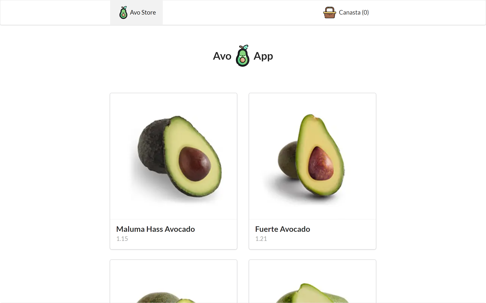

# Avo App

Es un sitio web de Ecommerce inspirada en el [curso de Nextjs de platzi](https://platzi.com/clases/next/) al cual se le agregaron funciones extra.

## Proyecto
[Deploy 🚀]()

## Funcionalidades

- [x] Listar productos de una base de datos ficticia.
- [x] Agregar productos al carrito de compras.
- [x] Eliminar productos del carrito de compras.

## Funcionalidades agregadas
- [x] Realizar pagos a través de tarjetas de credito.
- [x] Disminuir o aumentar la cantidad de un item en el carrito de compras.

## Tecnologias utilizadas
- [Nextjs](https://nextjs.org/)
- [Typescript](https://www.typescriptlang.org/)
- [Semantic UI ](https://react.semantic-ui.com/)

## Instalación y uso

Clonar el repositorio:
```
git clone https://github.com/JMauricio22/avo-app
```

Instalar dependencias:
```
npm install
```
Ejecutar la aplicación:
```
npm run dev
```

## Contacto
- [Github @JMauricio22](https://github.com/JMauricio22)